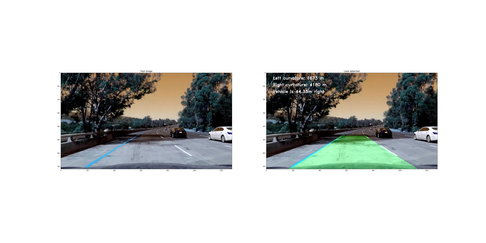

## Advanced Lane Finding

---

Goal is to write a software pipeline to identify the lane boundaries in a video

**Advanced Lane Finding Project**

The goals / steps of this project are the following:

* Compute the camera calibration matrix and distortion coefficients given a set of chessboard images.
* Apply a distortion correction to raw images.
* Use color transforms, gradients, etc., to create a threshold binary image.
* Apply a perspective transform to rectify binary image ("birds-eye view").
* Detect lane pixels and fit to find the lane boundary.
* Determine the curvature of the lane and vehicle position with respect to center.
* Warp the detected lane boundaries back onto the original image.
* Output visual display of the lane boundaries and numerical estimation of lane curvature and vehicle position.

## Rubric Points

The [rubric](https://review.udacity.com/#!/rubrics/571/view) points were individually addressed in the implementation and described in [IPython notebook](./Advanced_Lane_Finding.ipynb) and [documentation](./Advanced_Lane_Finding.md)